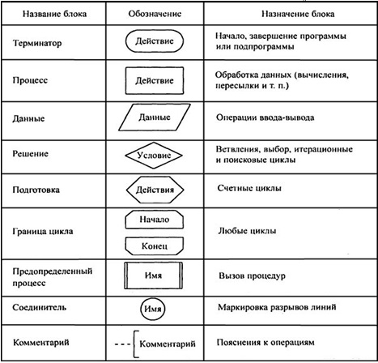

# Основы алгоритмизации и программирования (письменно)

# СОДЕРЖАНИЕ УЧЕБНОГО МАТЕРИАЛА

## [ㅤ**РАЗДЕЛ 1. ОСНОВЫ АЛГОРИТМИЗАЦИИ**](#раздел-1-основы-алгоритмизации)

### [ㅤТема 1. Общие сведения об алгоритмах](#тема-1-общие-сведения-об-алгоритмах)

-   [Алгоритм и его свойства](#алгоритм-и-его-свойства)
-   [Разновидности структур алгоритмов](#разновидности-структур-алгоритмов)
-   [Способы описания алгоритмов](#способы-описания-алгоритмов-словесное-описание-графическое-представление-запись-на-алгоритмическом-языке)
-   [Символы схем](#символы-схем)
-   [Стандартизация графического представления алгоритмов](#стандартизация-графического-представления-алгоритмов)

### [ㅤТема 2. Разновидности структур алгоритмов](#тема-2-разновидности-структур-алгоритмов)

-   [Типы вычислительных процессов](#типы-вычислительных-процессов)
-   [Линейный вычислительный процесс](#линейный-вычислительный-процесс)
-   [Разветвляющийся вычислительный процесс](#разветвляющийся-вычислительный-процесс)
-   [Циклический вычислительный процесс](#циклический-вычислительный-процесс)
-   [Классификация циклов](#классификация-циклов)
-   [Параметрические циклы](#параметрические-циклы-с-предусловием-с-постусловием-со-счётчиком)
-   [Итерационные циклы](#итерационные-циклы)
-   [Примеры вычислительных алгоритмов](#примеры-вычислительных-алгоритмов)

### [ㅤТема 3. Структурное программирование](#тема-3-структурное-программирование)

-   [Общие сведения о структурном программировании](#общие-сведения-о-структурном-программировании)
-   [Представление структурированных схем](#представление-структурированных-схем)
-   [Восходящее и нисходящее проектирование](#восходящее-и-нисходящее-проектирование)
-   [Преобразование неструктурированных программ в структурированные](#преобразование-неструктурированных-программ-в-структурированные)

<br/>
<br/>

## [ㅤ**РАЗДЕЛ 2. ОСНОВЫ КОМПЬЮТЕРНОЙ ТЕХНИКИ И ВЫЧИСЛИТЕЛЬНЫХ ПРОЦЕССОВ**](#раздел-2-основы-компьютерной-техники-и-вычислительных-процессов)

### [ㅤТема 4. Арифметические основы компьютера](#тема-4-арифметические-основы-компьютера)

-   [Системы счисления](#системы-счисления)
-   [Классификация систем счисления](#классификация-систем-счисления)
-   [Перевод чисел из одной системы счисления в другую](#перевод-чисел-из-одной-системы-счисления-в-другую)
-   [Арифметические операции над положительными числами](#арифметические-операции-над-положительными-числами)
-   [Арифметика с алгебраическими числами](#арифметика-с-алгебраическими-числами)
-   [Двоичные коды и операции с двоичными кодами](#двоичные-коды-и-операции-с-двоичными-кодами)
-   [Представление данных в памяти компьютера](#представление-данных-в-памяти-компьютера)
-   [Представление чисел с фиксированной точкой](#представление-чисел-с-фиксированной-точкой)
-   [Представление чисел с плавающей точкой](#представление-чисел-с-плавающей-точкой)

### [ㅤТема 5. Принцип программного управления](#тема-5-принцип-программного-управления)

-   [Принцип программного управления](#принцип-программного-управления)
-   [Автоматическое выполнение команд](#автоматическое-выполнение-команд)
-   [Процессы сборки и компиляции программ и исполнения программ](#процессы-сборки-и-компиляции-программ-и-исполнения-программ)

<br/>
<br/>

## [ㅤ**РАЗДЕЛ 3. ОБЩИЕ СВЕДЕНИЯ О ПРОГРАММНОМ**](#раздел-3-общие-сведения-о-программном)

### [ㅤТема 6. Стадии разработки программного обеспечения](#тема-6-стадии-разработки-программного-обеспечения)

-   [Разработка программного обеспечения как многошаговый процесс](#разработка-программного-обеспечения-как-многошаговый-процесс)
-   [Этапы постановки и решения задачи на компьютере](#этапы-постановки-и-решения-задачи-на-компьютере)
-   [Цели и задачи каждой стадии разработки программного обеспечения](#цели-и-задачи-каждой-стадии-разработки-программного-обеспечения)

### [ㅤТема 7. Системы программирования](#тема-7-системы-программирования)

-   [История создания и развития систем программирования](#история-создания-и-развития-систем-программирования)
-   [Классификация систем программирования](#классификация-систем-программирования)
-   [Назначение и состав системы программирования](#назначение-и-состав-системы-программирования)
-   [Основные понятия языка](#основные-понятия-языка)
-   [Классификация языков программирования](#классификация-языков-программирования)

<br/>
<br/>

## [ㅤ**РАЗДЕЛ 4. ОСНОВЫ ПРОГРАММИРОВАНИЯ И СРЕДА РАЗРАБОТКИ**](#раздел-4-основы-программирования-и-среда-разработки)

### [ㅤТема 8. Основные элементы языков Pascal, C/C++](#тема-8-основные-элементы-языков-pascal-cc)

-   [Основные понятия языка](#основные-понятия-языка)
-   [Лексемы языка: алфавит, константы, зарезервированные слова](#лексемы-языка-алфавит-константы-зарезервированные-слова)
-   [Типы лексем](#типы-лексем)
-   [Идентификаторы, комментарии и операции](#идентификаторы-комментарии-и-операции)
-   [Выражения](#выражения)
-   [Приоритет выполнения операций](#приоритет-выполнения-операций)
-   [Основные операторы языка](#основные-операторы-языка)
-   [Присваивание](#присваивание)
-   [Пустой оператор](#пустой-оператор)
-   [Условный оператор, оператор выбора](#условный-оператор-оператор-выбора)
-   [Организация циклов](#организация-циклов)
-   [Простой и составной оператор](#простой-и-составной-оператор)
-   [Основные возможности организации ввода/вывода](#основные-возможности-организации-ввода-вывода)
-   [Структура программного модуля](#структура-программного-модуля)
-   [Обязательные и дополнительные компоненты программного модуля](#обязательные-и-дополнительные-компоненты-программного-модуля)
-   [Стандартные функции и структура простейшей программы](#стандартные-функции-и-структура-простейшей-программы)

### [ㅤТема 9. Типы данных](#тема-9-типы-данных)

-   [Понятие типизации](#понятие-типизации)
-   [Понятие типа данных](#понятие-типа-данных)
-   [Классификация типов данных](#классификация-типов-данных)
-   [Базовые типы данных языка](#базовые-типы-данных-языка)
-   [Типизированные объекты (константы, переменные)](#типизированные-объекты-константы-переменные)
-   [Совместимость типов](#совместимость-типов)

### [ㅤТема 10. Сложные типы данных](#тема-10-сложные-типы-данных)

-   [Массивы](#массивы-определение-описание-размещение-в-памяти-использование)
-   [Особенности работы с массивами](#особенности-работы-с-массивами)
-   [Символьные переменные и строки](#символьные-переменные-и-строки)
-   [Особенности представления строк в Pascal, C/C++](#особенности-представления-строк-в-pascal-cc)
-   [Организация, размещение в памяти, процедуры и функции обработки строк и символов](#организация-размещение-в-памяти-процедуры-и-функции-обработки-строк-и-символов)
-   [Множества](#множества-определение-размещение-в-памяти-операции-процедуры-и-функции-над-множествами)
-   [Записи](#записи)
-   [Организация, размещение](#организация-размещение)
-   [Записи с вариантами](#записи-с-вариантами)

### [ㅤТема 11. Динамические структуры данных](#тема-11-динамические-структуры-данных)

-   [Указатели](#указатели)
-   [Динамические структуры данных](#динамические-структуры-данных-назначение-виды-организация)
-   [Стандартные процедуры резервирования и освобождения памяти](#стандартные-процедуры-резервирования-и-освобождения-памяти)
-   [Динамические массивы](#динамические-массивы)
-   [Списковые структуры](#списковые-структуры)
-   [Классификация списковых структур](#классификация-списковых-структур)
-   [Стеки, очереди, односвязные и двухсвязные линейные списки, кольца](#стеки-очереди-односвязные-и-двухсвязные-линейные-списки-кольца)
-   [Основные операции со стеклом и с очередью](#основные-операции-со-стеком-и-с-очередью)
-   [Линейный упорядоченный список (словарь)](#линейный-упорядоченный-список-словарь)
-   [Рекурсивная и итеративная (нерекурсивная) реализации основных операций со списком](#рекурсивная-и-итеративная-нерекурсивная-реализации-основных-операций-со-списком)

### [ㅤТема 12. Подпрограммы и библиотеки](#тема-12-подпрограммы-и-библиотеки)

-   [Модульность в программировании](#модульность-в-программировании)
-   [Понятие и структура подпрограммы](#понятие-и-структура-подпрограммы)
-   [Описание процедур и функций на языках Pascal, C/C++](#описание-процедур-и-функций-на-языках-pascal-cc)
-   [Виды параметров подпрограмм, локальные и глобальные переменные](#виды-параметров-подпрограмм-локальные-и-глобальные-переменные)
-   [Организация вызова подпрограмм, особенности их использования](#организация-вызова-подпрограмм-особенности-их-использования)
-   [Понятие рекурсии](#понятие-рекурсии)
-   [Рекуррентные выражения](#рекуррентные-выражения)

### [ㅤТема 13. Библиотеки](#тема-13-библиотеки)

-   [Организация библиотек](#организация-библиотек)
-   [Использование библиотек в программе](#использование-библиотек-в-программе)
-   [Стандартные библиотечные модули и внешние модули пользователя](#стандартные-библиотечные-модули-и-внешние-модули-пользователя)

### [ㅤТема 14. Работа с файлами](#тема-14-работа-с-файлами)

-   [Виды файлов](#виды-файлов)
-   [Процедуры и функции, определенные над файлами различного вида](#процедуры-и-функции-определенные-над-файлами-различного-вид)
-   [Нетипизированные файлы, их назначение и особенности использования](#нетипизированные-файлы-их-назначение-и-особенности-использования)
-   [Процедуры и функции обработки типизированных файлов](#процедуры-и-функции-обработки-типизированных-файлов)

<br/>
<br/>

## [ㅤ\*\*РАЗДЕЛ 5. ОБЪЕКТНО-ОРИЕНТИРОВАННОЕ ПРОГРАММИРОВАНИЕ](#раздел-5-объектно-ориентированное-программирование)

### [ㅤТема 15. Базовые понятия объектно-ориентированной технологии программирования](#тема-15-базовые-понятий-объектно-ориентированной-технологии-программирования)

-   [Класс, объект, его свойства. Синтаксис и особенности описания](#класс-объект-его-свойства-синтаксис-и-особенности-описания)
-   [Основные принципы объектно-ориентированной парадигмы: инкапсуляция, наследование, полиморфизм](#основные-принципы-объектно-ориентированной-парадигмы-инкапсуляция-наследование-полиморфизм)

### [ㅤТема 16. Описание класса](#тема-16-описание-класса)

-   [Описание класса](#описание-класса)
-   [Присваивание объектов](#присваивание-объектов)
-   [Уровни инкапсуляции](#уровни-инкапсуляции)
-   [Реализация методов](#реализация-методов)
-   [Создание и удаление объекта](#создание-и-удаление-объекта)
-   [Вызов родительских методов](#вызов-родительских-методов)
-   [Обращение к полям и методам внутри объекта](#обращение-к-полям-и-методам-внутри-объекта)
-   [Дружественность](#дружественность)

### [ㅤТема 17. Типы методов, инициализация и разрушение](#тема-17-типы-методов-инициализация-и-разрушение)

-   [Типы методов классов: статические, виртуальные, динамические, абстрастные, перегружаемые](#типы-методов-классов-статические-виртуальные-динамические-абстрастные-перегружаемые)
-   [Инициализация и разрушение объекта](#инициализация-и-разрушение-объекта)
-   [Конструкторры и деструкторы](#конструкторры-и-деструкторы)

<br/>
<br/>
<br/>
<br/>
<br/>
<br/>
<br/>
<br/>
<br/>
<br/>

## **РАЗДЕЛ 1. ОСНОВЫ АЛГОРИТМИЗАЦИИ**

## Тема 1. Общие сведения об алгоритмах

-   ### Алгоритм и его свойства.

```txt
Алгоритм – это последовательность шагов, которая приводит к решению задачи. Свойства алгоритма:

Дискретность     –> выполняется пошагово.
Определенность   –> каждый шаг однозначен.
Конечность       –> заканчивается за конечное число шагов.
Результативность –> приводит к нужному результату.
Массовость       –> применим для разных исходных данных.
```

<br/>
<br/>

-   ### Разновидности структур алгоритмов.

```txt
Линейный         –>  шаги выполняются последовательно.

Разветвленный    –>  есть условные операторы (если...то).

Циклический      –>  содержит повторяющиеся действия (пока, для).
```

<br/>
<br/>

-   ### Способы описания алгоритмов: словесное описание, графическое представление, запись на алгоритмическом языке.

```txt
Словесное описание – текстовый формат, например: "Возьми два числа, сложи их, выведи результат".

Графическое представление (блок-схемы) – с использованием стандартных символов.

Запись на алгоритмическом языке – формализованный псевдокод или языки программирования (Python, C и др.).
```

<br/>
<br/>

-   ### Символы схем.


<br/>
<br/>

-   ### Стандартизация графического предсоставления алгоритмов.

[https://studme.org/407636/informatika/kakim_dolzhen_standart_algoritmy](https://studme.org/407636/informatika/kakim_dolzhen_standart_algoritmy)

<br/>
<br/>

## Тема 2. Разновидности структур алгоритмов

-   ### Типы вычислительных процессов.

    > Чуть ниже определения

    -   [Линейный](#линейный-вычислительный-процесс)
    -   [Разветвляющийся](#разветвляющийся-вычислительный-процесс)
    -   [Циклический](#циклический-вычислительный-процесс)

<br/>

-   ### Линейный вычислительный процесс.

```txt
Это процесс, где все действия выполняются поочередно, без ветвлений и циклов.
Каждый шаг зависит только от предыдущего, и процесс завершится после выполнения всех шагов.
```

<br/>

-   ### Разветвляющийся вычислительный процесс.

```txt
В этом процессе в зависимости от условий выполняются различные действия.
Основной элемент — ветвление, которое представлено условными операторами (например, если...то...иначе).
Пример: выбор из нескольких вариантов на основе условий.
```

<br/>

-   ### Циклический вычислительный процесс.

```txt
Вычислительный процесс, в котором шаги повторяются несколько раз, пока не выполнено некотороеусловие.
Это основной элемент цикла.
Циклические процессы могут быть с предусловием (проверка перед выполнением) или с постусловием (проверка после выполнения).
```

<br/>
<br/>

-   ### Классификация циклов.
-   ### Параметрические циклы: с предусловием, с постусловием, со счётчиком.
<br/>

\_\_\_\_\_\_\_\_\_\_\_\_\_**ЦИКЛЫ С ПРЕДУСЛОВИЕМ**\_\_\_\_\_\_\_\_\_\_\_\_\_

```js
Проверка условия до выполнения цикла.
Если условие не выполнено с самого начала, цикл не выполняется ни разу.

Пример: цикл пока.
while (условие):
    // действия
```

<br/>

\_\_\_\_\_\_\_\_\_\_\_\_\_**ЦИКЛЫ С ПОСТУСЛОВИЕМ**\_\_\_\_\_\_\_\_\_\_\_\_\_

```js
Условие проверяется после выполнения тела цикла.
Цикл гарантированно выполняется хотя бы один раз.

Пример: цикл делать...пока.
do:
    // действия
while (условие);

```

<br/>

\_\_\_\_\_\_\_\_\_\_\_\_\_**ЦИКЛЫ СО СЧЁТЧИКОМ**\_\_\_\_\_\_\_\_\_\_\_\_\_

```js
Циклы, где количество повторений известно заранее.

Пример: цикл для, где задается диапазон значений счётчика.
for i in range(10):
    // действия

```

<br/>
<br/>

-   ### Итерационные циклы.

```txt
    Циклы, в которых повторение действий происходит на каждой итерации до достижения условия выхода.
    Такие циклы широко применяются в алгоритмах, когда количество повторений неизвестно заранее.
    Пример: алгоритм поиска в списке.
```

<br/>
<br/>

-   ### Примеры вычислительных алгоритмов.

```txt
Алгоритм вычисления факториала
Пример циклического процесса с предустановленным количеством повторений, например, для числа 5:
5! = 5 × 4 × 3 × 2 × 1.
Используется цикл с подсчётом от 1 до заданного числа.

Алгоритм поиска минимального элемента в массиве
Разветвляющийся процесс, где для каждого элемента массива сравнивается с текущим минимальным значением.

Алгоритм сортировки пузырьком
Итерационный процесс, где элементы массива несколько раз сравниваются и меняются местами,
пока не будет выполнено условие.

```

<br/>
<br/>
<br/>

## Тема 3. Структурное программирование

-   ### Общие сведения о структурном программировании.

```txt
    Структурное программирование – это методология разработки программ,
    которая основывается на использовании трех базовых структур управления:
        - последовательность.
        - ветвление.
        - цикл.

    Эта методология предполагает:
        - Отказ от использования операторов перехода (например, goto), чтобы повысить читаемость и поддержку программ.
        - Строгое деление программы на функции и модули, что облегчает ее тестирование и отладку.
        - Является основой для многих современных языков программирования, таких как C, Pascal, Python и другие.
```

<br/>
<br/>

-   ### Представление структурированных схем.


<br/>
<br/>

-   ### Восходящее и нисходящее проектирование.

\_\_\_\_\_\_\_\_\_\_\_\_\_**ВОСХОДЯЩЕЕ ПРОЕКТИРОВАНИЕ (bottom-up design)**\_\_\_\_\_\_\_\_\_\_\_\_\_

```txt
В этом подходе разрабатываются отдельные модули или компоненты программы, которые затем объединяются
в более высокоуровневую структуру.
Начинаем с самых низких уровней (конкретных функций или частей программы)и постепенно
поднимаемся к верхним уровням (основной логике).
Этот метод удобен при разработке сложных систем, где детали должны быть сначала реализованы и протестированы.
```

\_\_\_\_\_\_\_\_\_\_\_\_\_**НИСХОДЯЩЕЕ ПРОЕКТИРОВАНИЕ (top-down design)**\_\_\_\_\_\_\_\_\_\_\_\_\_

```txt
В этом подходе мы начинаем с общего видения программы и постепенно спускаемся
к более детализированным модулям и функциям.
Сначала определяется общая структура программы, а затем ее части разбиваются
на более мелкие задачи и модули.
Это удобный подход для проектирования программ с заранее известными требованиями и структурой.
```

<br/>
<br/>

-   ### Преобразование неструктурированных программ в структурированные.

```txt

Неструктурированные программы часто содержат много неупорядоченных переходов
(например, использования оператора goto), что делает их сложными для понимания и модификации.

Чтобы преобразовать такие программы в структурированные, применяются следующие шаги:
    - Удаление операторов goto и замена их на стандартные конструкции управления (циклы, условные операторы).
    - Реорганизация кода в функции и процедуры с четким разделением задач, что помогает улучшить читаемость и поддержку.
    - Использование структурированных схем для представления алгоритмов и улучшения понимания логики программы.
    - Применение нисходящего или восходящего проектирования для улучшения архитектуры программы и ее модульности.

Процесс преобразования неструктурированных программ в структурированные включает в себя анализ
и реорганизацию кода, избавление от излишних переходов и явное разделение задач.

```

<br/>
<br/>
<br/>
<br/>
<br/>
<br/>
<br/>
<br/>
<br/>
<br/>

## **РАЗДЕЛ 2. ОСНОВЫ КОМПЬЮТЕРНОЙ ТЕХНИКИ И ВЫЧИСЛИТЕЛЬНЫХ ПРОЦЕССОВ**

## Тема 4. Арифметические основы компьютера

-   ### Системы счисления.

```txt
Система счисления — это способ представления чисел с использованием определенного набора символов (цифр).
Каждая система счисления имеет свою базу, которая определяет количество символов, используемых для представления чисел.

Примеры систем счисления:
    - ДЕСЯТИЧНАЯ (основная) —> использует цифры от 0 до 9.
    - ДВОИЧНАЯ              —> использует только два символа: 0 и 1.
    - ВОСЬМЕРИЧНАЯ          —> использует цифры от 0 до 7.
    - ШЕСТНАДЦАТЕРИЧНАЯ     —> использует цифры от 0 до 9 и буквы A-F для чисел 10-15.

```

<br/>
<br/>

-   ### Классификация систем счисления.

```txt
ПО БАЗЕ (ОСНОВАНИЮ):
    - Десятичная (10):        Базируется на десяти символах (0-9).
    - Двоичная (2):           Базируется на двух символах (0, 1).
    - Восьмеричная (8):       Базируется на восьми символах (0-7).
    - Шестнадцатеричная (16): Базируется на шестнадцати символах (0-9, A-F).

ПО НАПРАВЛЕНИЮ ЗАПИСИ:
    - Прямые   —> числа записываются в обычной последовательности (например, десятичная система).
    - Обратные —> для представления чисел используется инвертированное расположение.
```

<br/>
<br/>

-   ### Перевод чисел из одной системы счисления в другую.

```js
Для перевода чисел между различными системами счисления можно использовать два основных подхода:
```

ПОДХОД 1:

```js
Из десятичной в любую другую:
Для этого число делится на основание новой системы (например, 2 для двоичной системы), и остатки от деления записываются
в обратном порядке.

Пример:
Перевод числа 13 в двоичную систему:
13 / 2 = 6, остаток 1
6 / 2 = 3, остаток 0
3 / 2 = 1, остаток 1
1 / 2 = 0, остаток 1
Ответ: 13 в десятичной = 1101 в двоичной.
```

ПОДХОД 2:

```js
Из любой системы в десятичную:
Для этого каждую цифру числа умножают на соответствующую степень основания системы счисления.

Пример:
Перевод числа 1011 из двоичной в десятичную:
(1 * 2^3) + (0 * 2^2) + (1 * 2^1) + (1 * 2^0) = 8 + 0 + 2 + 1 = 11.

```

<br/>
<br/>

-   ### Арифметические операции над положительными числами.

```txt
Арифметические операции с положительными числами в системах счисления могут включать:

1. Сложение:
В каждой системе счисления при сложении двух чисел важно учитывать базу системы.
Например, в двоичной системе, при сложении 1 + 1 получается 10.


2. Вычитание:
Подобно сложению, в системах счисления учитываются заимствования при вычитании.


3. Умножение и деление:
Умножение и деление выполняются как в обычной десятичной системе, но с учетом специфики другой системы счисления.
```

<br/>
<br/>

-   ### Арифметика с алгебраическими числами.

```txt
Арифметика с алгебраическими числами включает работу с числами, которые могут быть как положительными, так и отрицательными.
Для представления отрицательных чисел используют методы:

1. Прямое представление:
Отрицательное число записывается с минусом перед числом.

2. Дополнение до двух:
Это метод представления отрицательных чисел в двоичной системе счисления.
Чтобы получить двоичное представление отрицательного числа, инвертируют все биты и прибавляют 1.
```

<br/>
<br/>

-   ### Двоичные коды и операции с двоичными кодами.

```txt
Двоичный код — это код, который использует два символа (0 и 1) для представления чисел. Двоичные операции включают:

1. Сложение: Аналогично сложению в десятичной системе, но с учетом двоичной логики (например, 1 + 1 = 10).

2. Вычитание: Производится аналогично, с учетом заимствований.

3. Умножение и деление: Проводятся побитно с использованием алгоритмов, специфичных для двоичной системы.

Пример операции:

Сложение в двоичной системе:
1011 (11)

1101 (13)
= 11000 (24).
```

<br/>
<br/>

-   ### Представление данных в памяти компьютера.

```txt
Данные в памяти компьютера обычно представляются в двоичной форме, где каждый бит может быть 0 или 1.
Операции с данными выполняются в соответствии с их представлением в двоичной системе.
Например, текстовые данные могут быть представлены с использованием кодировок, таких как ASCII или Unicode,
которые используют двоичные коды для представления символов.
```

<br/>
<br/>

-   ### Представление чисел с фиксированной точкой.

```txt
Числа с фиксированной точкой — это числа, в которых десятичная точка находится на фиксированной позиции.
Такие числа могут быть представлены как целая и дробная часть, где дробная часть всегда имеет фиксированное количество разрядов.

Пример:
Для представления числа 23.75 в формате с фиксированной точкой, если разделить его на 4 разряда для дробной части,
оно будет выглядеть как 23.1100 (в двоичной системе).


```

<br/>
<br/>

-   ### Представление чисел с плавающей точкой.

```txt
Числа с плавающей точкой представляют собой числа, у которых десятичная точка может перемещаться, позволяя представлять
очень большие и очень маленькие числа. В компьютерах они обычно представлены по формату IEEE 754, который включает:
    - Знак (1 бит),
    - Порядок (некоторое количество бит для экспоненты),
    - Мантиса (основное число, представляемое с точностью).

Пример представления:
Число 12.75 в формате с плавающей точкой будет представлено в виде мантисы и экспоненты (в зависимости от точности и формата).
```

<br/>
<br/>
<br/>

## Тема 5. Принцип программного управления

-   ### Принцип программного управления.

```txt
Программное управление — это метод управления процессами выполнения программ, при котором решение о выполнении той или иной
команды принимается не аппаратной частью (например, процессором), а непосредственно самой программой.
Это достигается с помощью использования инструкций и управляющих структур (условий, циклов, функций), которые определяют порядок выполнения.

Программное управление реализуется через:
    - Условные операторы (например, if, switch), которые выбирают путь выполнения программы в зависимости от значений переменных.
    - Циклы (например, while, for), которые позволяют повторять одни и те же действия несколько раз.
    - Функции и процедуры, которые позволяют разбить программу на модули и вызывать их в нужном порядке.

Этот принцип лежит в основе всех высокоуровневых языков программирования.
```

<br/>
<br/>

-   ### Автоматическое выполнение команд.

```txt
Автоматическое выполнение команд означает, что команды программы выполняются автоматически, без необходимости вмешательства
пользователя.

Это возможно благодаря:
    - Интерпретаторам — программам, которые выполняют инструкции программы поочередно, преобразуя их в машинный код на лету.
    - Компиляторам — программам, которые преобразуют весь исходный код в машинный код за один этап, а затем его выполнение происходит без дополнительных преобразований.
    - Автоматическим скриптам — программам, которые выполняются по расписанию или при наступлении определенных событий (например, скрипты для автоматизации системных задач).

Примером может быть выполнение команд для установки или конфигурации программного обеспечения через командные файлы или автоматические скрипты.
```

<br/>
<br/>

-   ### Процессы сборки и компиляции программ и исполнения программ.

```txt
1. Сборка программы(или build) — это процесс подготовки программы к исполнению.

Он включает несколько этапов:
    - Компиляция: Преобразование исходного кода (например, на C или Java) в машинный код или байт-код.
    Компилятор анализирует код, проверяет его на ошибки и генерирует исполнимые файлы.
    - Линковка: На этом этапе компоновщик объединяет все объектные файлы и библиотеки, используемые в программе,
    в единую исполнимую программу.

Пример: В C программа компилируется в объектный файл с помощью компилятора, а затем все объектные файлы линкуются для создания
исполнимого файла.


2. Компиляция программы — это процесс преобразования исходного кода в машинный код, который может быть выполнен процессором.
В процессе компиляции:
    - Лексический анализ: Разбор исходного текста на элементы (лексемы).
    - Синтаксический анализ: Проверка структуры программы.
    - Генерация кода: Преобразование в низкоуровневые инструкции.


3. Исполнение программы — это процесс, при котором компьютер выполняет машинные инструкции, полученные в результате компиляции
или интерпретации исходного кода.
Это может происходить в двух режимах:
    - Интерпретированный режим: Когда исходный код выполняется командой за командой интерпретатором.
    - Исполнимая программа: Когда компилированный машинный код напрямую выполняется процессором.


```

<br/>
<br/>
<br/>
<br/>
<br/>
<br/>
<br/>
<br/>
<br/>
<br/>

## **РАЗДЕЛ 3. ОБЩИЕ СВЕДЕНИЯ О ПРОГРАММНОМ**

## Тема 6. Стадии разработки программного обеспечения

-   ### Разработка программного обеспечения как многошаговый процесс.

```txt
Разработка программного обеспечения — это сложный многошаговый процесс, который включает в себя несколько этапов,
каждый из которых направлен на создание качественного и эффективного продукта.

Этот процесс можно разбить на следующие основные стадии:
    - АНАЛИЗ ТРЕБОВАНИЙ             —> сбор информации о потребностях заказчика и конечных пользователей.
    - ПРОЕКТИРОВАНИЕ СИСТЕМЫ        —> создание архитектуры и структуры программы.
    - РЕАЛИЗАЦИЯ (программирование) —> непосредственно написание кода.
    - ТЕСТИРОВАНИЕ                  —> проверка программного обеспечения на наличие ошибок и несоответствий требованиям.
    - ВНЕДРЕНИЕ                     —> установка и настройка ПО в рабочей среде.
    - СОПРОВОЖДЕНИЕ                 —> поддержка программы в процессе эксплуатации и устранение возникающих проблем.

Каждый этап направлен на решение специфических задач и требует применения различных методов и инструментов.


```

<br/>
<br/>

-   ### Этапы постановки и решения задачи на компьютере.

```txt

1. Постановка задачи
На этом этапе определяются цели и требования к решению задачи.
Важно четко понять, какую проблему необходимо решить, и какие критерии будут использоваться для оценки результата.
Это может включать в себя:
    - Сбор информации о проблеме.
    - Формулировка целей.
    - Описание требований и ограничений.


2. Моделирование задачи
Создание абстракции задачи с использованием математических моделей, алгоритмов или диаграмм.
На этом этапе формулируется решение, которое будет выполняться с помощью компьютера, а также создается план действий.


3. Решение задачи
Это основной этап, где разрабатывается и реализуется алгоритм для решения поставленной задачи. Включает:

    - Разработка программы (кодирование).
    - Тестирование и отладка.
    - Проверка корректности выполнения решения.


4. Оценка результата
После решения задачи важно оценить, насколько оно соответствует целям, поставленным на начальном этапе.
Проверяется эффективность работы программы, производительность, а также ее корректность.

```

<br/>
<br/>

-   ### Цели и задачи каждой стадии разработки программного обеспечения.

```txt
ЭТАП 1: АНАЛИЗ ТРЕБОВАНИЙ
Цели: Определить, что именно должно делать ПО, какие функциональные и нефункциональные требования предъявляются к системе.

Задачи:
    - Собрать информацию о требованиях заказчика и пользователей.
    - Создать спецификацию требований.
    - Оценить ограничения, такие как сроки, бюджет и технологии.
```

```txt
ЭТАП 2: ПРОЕКТИРОВАНИЕ СИСТЕМЫ
Цели: Разработать архитектуру системы и спроектировать компоненты ПО.

Задачи:
    - Определить структуру системы и взаимодействие ее компонентов.
    - Спроектировать интерфейсы и базу данных.
    - Разработать детальные схемы и алгоритмы.
```

```txt
ЭТАП 3: РЕАЛИЗАЦИЯ (ПРОГРАММИРОВАНИЕ)
Цели: Написать исходный код программы на основе проектной документации.

Задачи:
    - Программирование функциональности по проекту.
    - Разработка модулей и интерфейсов.
    - Интеграция различных частей системы.
```

```txt
ЭТАП 4: ТЕСТИРОВАНИЕ
Цели: Проверить работоспособность и качество программы, убедиться, что она соответствует требованиям.

Задачи:
    - Провести тестирование отдельных модулей (модульное тестирование).
    - Выполнить интеграционное тестирование.
    - Выполнить системное тестирование для проверки соответствия ПО всем требованиям.
```

```txt
ЭТАП 5: ВНЕДРЕНИЕ
Цели: Установить ПО в рабочую среду и убедиться в его функционировании.

Задачи:
    - Разработать и выполнить процесс установки.
    - Настроить системы, пользователи и серверы.
    - Обучить пользователей работе с ПО.

```

```txt
ЭТАП 6: СОПРОВОЖДЕНИЕ
Цели: Поддерживать работоспособность ПО, устранять проблемы, обновлять и модернизировать программу.

Задачи:
    - Осуществлять техническую поддержку и устранение ошибок.
    - Вносить изменения в ПО по мере возникновения новых требований.
    - Обновлять и улучшать функциональность.

```

<br/>
<br/>

<br/>
<br/>
<br/>

## Тема 7. Системы программирования

-   ### История создания и развития систем программирования.

```txt
Системы программирования начали развиваться с момента появления первых электронных вычислительных машин.
Поначалу для программирования использовались машинные коды, что было крайне неудобно.
Однако с течением времени появились более высокоуровневые средства разработки.


1950-60-е годы
    - первая волна программирования на машинных кодах, затем на ассемблере.
    Появляются первые языки программирования, такие как Fortran (1957) и Lisp (1958), которые значительно улучшили процесс разработки программ.


1970-е годы
    - появляется язык C, а также Pascal, что привело к появлению систем, ориентированных на удобство и безопасность.


1980-е и 1990-е годы
    - начало широкого распространения языков программирования высокого уровня, таких как C++, Java,
    а также разработка систем для создания графических интерфейсов и разработки для сетевых приложений.


Современность
    - продолжается развитие языков программирования, появляется большое количество доменно-ориентированных языков,
    таких как Python, Ruby, и новые технологии программирования, такие как искусственный интеллект и машинное обучение.


```

<br/>
<br/>

-   ### Классификация систем программирования.

```txt
Системы программирования можно классифицировать по различным признакам:

По типу:
    - Операционные системы — для управления аппаратными средствами.
    - Языки программирования — для разработки программного обеспечения (например, C, Python).
    - Инструментальные средства разработки — различные IDE, отладчики, компиляторы.


По уровню абстракции:
    - Машинные системы — напрямую работают с машинным кодом.
    - Средства низкого уровня — ассемблеры, которые предоставляют более высокую абстракцию, но все еще близки к железу.
    - Средства высокого уровня — компиляторы, интерпретаторы для языков высокого уровня (например, Python).


По области применения:
    - Общие системы программирования — универсальные языки и инструменты, такие как C, Java, Python.
    - Специальные системы программирования — для работы в узких областях, например, языки для научных вычислений (Fortran), графики (OpenGL), разработки веб-приложений (JavaScript).


```

<br/>
<br/>

-   ### Назначение и состав системы программирования.

```txt
Система программирования — это комплекс программных средств, предназначенных для разработки программного обеспечения. Она включает в себя:

    - Язык программирования — набор правил и синтаксиса для написания программ (например, Python, Java).
    - Компилятор или интерпретатор — инструмент, который преобразует исходный код программы в машинный код или байт-код для выполнения.
    - Отладчик — средство для поиска и исправления ошибок в коде.
    - Среда разработки (IDE) — интегрированная среда, которая включает редактор, отладчик, компилятор и другие инструменты для эффективного написания и тестирования кода.
    - Библиотеки и фреймворки — наборы готовых решений для облегчения разработки (например, стандартные библиотеки в C или фреймворк Django для Python).

Назначение системы программирования — обеспечить удобный и эффективный процесс разработки программного обеспечения.
```

<br/>
<br/>

-   ### Основные понятия языка.

```txt
    - Синтаксис — правила, определяющие структуру программы, то, как должны быть написаны инструкции (например, правила для составления выражений, операндов и операторов).
    - Семантика — смысл конструкций языка, что конкретно происходит, когда выполняется та или иная инструкция.
    - Лексема — минимальная единица языка программирования, которая имеет смысл, например, идентификаторы, операторы, числа.
    - Алгоритм — последовательность шагов для решения задачи, которая реализуется в программе.
    - Модуль — самостоятельная часть программы, которая решает одну задачу, и может быть повторно использована.
```

<br/>
<br/>

-   ### Классификация языков программирования.

```txt
Языки программирования можно классифицировать по различным критериям:

По уровню абстракции:
    - Машинные языки (низкий уровень) — программирование напрямую на машинных кодах.
    - Ассемблеры (низкий уровень) — работают с командами процессора, но с использованием символов вместо чисел.
    - Языки высокого уровня — абстрагируются от аппаратных деталей и предоставляют более высокоуровневые конструкции (например, C, Java, Python).


По парадигме программирования:
    - Императивные — описывают алгоритмы как последовательность команд, например, C, Java.
    - Декларативные — описывают, что должно быть сделано, а не как это сделать (например, SQL, HTML).
    - Объектно-ориентированные — организуют программу в виде объектов, которые взаимодействуют друг с другом (например, C++, Python).
    - Функциональные — основываются на математической концепции функций (например, Haskell, Lisp).


По области применения:
    - Общие языки — универсальные языки, которые можно использовать для разработки любых типов программ (например, Python, C).
    - Специализированные языки — предназначены для определенных областей, например, SQL для работы с базами данных, VHDL для проектирования электронных схем.
```

<br/>
<br/>

<br/>
<br/>
<br/>
<br/>
<br/>
<br/>
<br/>
<br/>
<br/>
<br/>

## **РАЗДЕЛ 4. ОСНОВЫ ПРОГРАММИРОВАНИЯ И СРЕДА РАЗРАБОТКИ**

## Тема 8. Основные элементы языков Pascal, C/C++

-   ### Основные понятия языка.

-   ### Лексемы языка: алфавит, константы, зарезервированные слова.

-   ### Типы лексем.

-   ### Идентификаторы, комментарии и операции.

-   ### Выражения.

-   ### Приоритет выполнения операций.

-   ### Основные операторы языка.

-   ### Присваивание.

-   ### Пустой оператор.

-   ### Условный оператор, оператор выбора.

-   ### Организация циклов.

-   ### Простой и составной оператор.

-   ### Основные возможности организации ввода/вывода.

-   ### Структура программного модуля.

-   ### Обязательные и дополнительные компоненты программного модуля.

-   ### Стандартные функции и структура простейшей программы.

<br/>
<br/>
<br/>

## Тема 9. Типы данных

-   ### Понятие типизации.

-   ### Понятие типа данных.

-   ### Классификация типов данных.

-   ### Базовые типы данных языка.

-   ### Типизированные объекты (константы, переменные).

-   ### Совместимость типов.

<br/>
<br/>
<br/>

## Тема 10. Сложные типы данных

-   ### Массивы: определение, описание, размещение в памяти, использование.

-   ### Особенности работы с массивами.

-   ### Символьные переменные и строки.

-   ### Особенности представления строк в Pascal, C/C++.

-   ### Организация, размещение в памяти, процедуры и функции обработки строк и символов.

-   ### Множества: определение, размещение в памяти, операции, процедуры и функции над множествами.

-   ### Записи.

-   ### Организация, размещение.

-   ### Записи с вариантами.

<br/>
<br/>
<br/>

## Тема 11. Динамические структуры данных

-   ### Указатели.

-   ### Динамические структуры данных: назначение, виды, организация.

-   ### Стандартные процедуры резервирования и освобождения памяти.

-   ### Динамические массивы.

-   ### Списковые структуры.

-   ### Классификация списковых структур.

-   ### Стеки, очереди, односвязные и двухсвязные линейные списки, кольца.

-   ### Основные операции со стеклом и с очередью.

-   ### Линейный упорядоченный список (словарь).

-   ### Рекурсивная и итеративная(нерекурсивная) реализации основных операций со списком.

<br/>
<br/>
<br/>

## Тема 12. Подпрограммы и библиотеки

-   ### Модульность в программировании.

-   ### Понятие и структура подпрограммы.

-   ### Описание процедур и функций на языках Pascal, C/C++.

-   ### Виды параметров подпрограмм, локальные и глобальные переменные.

-   ### Организация вызова подпрограмм, особенности их использования.

-   ### Понятие рекурсии.

-   ### Рекуррентные вырожения.

<br/>
<br/>
<br/>

## Тема 13. Библиотеки

-   ### Организация библиотек.

-   ### Использование библиотек в программе.

-   ### Стандартные библиотечные модули и внешние модули пользователя.

<br/>
<br/>
<br/>

## Тема 14. Работа с файлами

-   ### Виды файлов.

-   ### Процедуры и функции, определенные над файлами различного вида.

-   ### Нетипизированные файлы, их назначение и особенности использования.

-   ### Процедуры и функции обработки типизированных файлов.

<br/>
<br/>
<br/>
<br/>
<br/>
<br/>
<br/>
<br/>
<br/>
<br/>

## **РАЗДЕЛ 5. ОБЪЕКТНО-ОРИЕНТИРОВАННОЕ ПРОГРАММИРОВАНИЕ**

## Тема 15. Базовые понятия объектно-ориентированной технологии программирования

-   ### Класс, объект, его свойства. Синтаксис и особенности описания.

> Класс — это шаблон или чертеж для создания объектов, который описывает их свойства (поля) и поведение (методы).

> Объект — это экземпляр класса, который содержит данные, определенные в классе, и может использовать методы, которые принадлежат классу. Каждый объект имеет свои уникальные значения свойств.

> Свойства объекта (или атрибуты) — это переменные, хранящие данные, которые принадлежат объекту. Они определяются внутри класса, а затем инициализируются при создании объекта.

> Методы — это функции, которые принадлежат классу и выполняются на объектах этого класса. В нашем примере метод display_info выводит информацию об автомобиле.

<br/>
<br/>

-   ### Основные принципы объектно-ориентированной парадигмы: инкапсуляция, наследование, полиморфизм.

> Наследование — это механизм, позволяющий создавать новые классы на основе уже существующих, облегчая повторное использование кода

> Инкапсуляция — механизм, позволяющий взятьданные и методы, работающие с этими данными и скрыть детали реализации от пользователя(программистов).

> Полиморфизм — это способность объектов разных классов обрабатывать одинаковые сообщения (вызывать одинаковые методы), но с разной реализацией. Это позволяет создавать более гибкие и расширяемые программы.

<br/>
<br/>
<br/>

## Тема 16. Описание класса

-   ### Описание класса.

```txt
В C++ класс — это набор данных (переменных) и функций (методов), которые работают с этими данными.

Здесь мы описали класс Car, который имеет три свойства: make, model, year, и метод displayInfo(), который выводит информацию о машине.
```

```cpp
#include <iostream>
#include <string>

class Car {
public:
    // Свойства (поля)
    string make;
    string model;
    int year;

    // Метод (функция)
    void displayInfo() {
        cout << year << " " << make << " " << model << endl;
    }
};

```

<br/>
<br/>

-   ### Присваивание объектов.

```txt
При присваивании объектов в C++ создается копия объекта. Это может быть выполнено с помощью конструктора копирования или оператора присваивания.
```

```cpp

#include <iostream>
#include <string>  // Для работы с типом string

using namespace std;

class Car {
public:
    string make;
    string model;
    int year;

    // Конструктор с параметрами
    Car(string m, string mo, int y) : make(m), model(mo), year(y) {}

    // Метод для отображения информации о машине
    void displayInfo() {
        cout << year << " " << make << " " << model << endl;
    }
};

int main() {
    // Создание объекта car1
    Car car1("Toyota", "Corolla", 2020);

    // Присваивание объекта car1 в car2 (клон car1)
    Car car2 = car1;  // Это вызовет копирующий конструктор

    // Вывод информации о car2
    car2.displayInfo();  // Выведет: 2020 Toyota Corolla
    return 0;
}


```

<br/>
<br/>

-   ### Уровни инкапсуляции.

```txt
C++ поддерживает три уровня инкапсуляции: public, protected и private.
    - public: члены доступны из любой части программы.
    - private: члены доступны только внутри класса.
    - protected: члены доступны в классе и в классах-наследниках.
```

```cpp
#include <iostream>
#include <string>  // Для работы с типом string
class Car {
public:
    string make;  // доступно везде
private:
    int year;  // доступно только внутри класса

protected:
    string model;  // доступно в классе и наследниках
};
```

<br/>
<br/>

-   ### Реализация методов.

```txt
Методы могут быть реализованы внутри класса или вне его.
```

Внутри класса:

```cpp
#include <iostream>
#include <string>

class Car {
public:
    string make;
    string model;
    int year;

    void displayInfo() {
        cout << year << " " << make << " " << model << endl;
    }
};

```

Вне класса:

```cpp
#include <iostream>
#include <string>

class Car {
public:
    string make;
    string model;
    int year;

    void displayInfo();
};

void Car::displayInfo() {
    cout << year << " " << make << " " << model << endl;
}
```

<br/>
<br/>

-   ### Создание и удаление объекта.

```txt
Объекты могут быть созданы как на стеке, так и на куче.

- На стеке: Объект автоматически уничтожается, когда выходит из области видимости.
- На куче:  Нужно вручную удалить объект, используя delete.
```

НА СТЕКЕ:

```cpp
Car car1("Toyota", "Corolla", 2020);
car1.displayInfo();  // Объект уничтожится по завершении работы функции

```

<br/>

НА КУЧЕ:

```cpp
Car* car2 = new Car("Honda", "Civic", 2021);
car2 -> displayInfo();  // car2 остается в памяти
delete car2;  // Освобождаем память
```

<br/>
<br/>

-   ### Вызов родительских методов.

```txt
Чтобы вызвать метод родительского класса, используем оператор :: или ключевое слово super (если класс наследуется).
```

```cpp
#include <iostream>
#include <string>

class Vehicle {
public:
    void start() {
        cout << "Vehicle started" << endl;
    }
};

class Car : public Vehicle {
public:
    void start() {
        Vehicle::start();  // Вызов родительского метода
        cout << "Car started" << endl;
    }
};

int main() {
    Car myCar;
    myCar.start();  // Сначала выведет "Vehicle started", затем "Car started"
    return 0;
}
```

<br/>
<br/>

-   ### Обращение к полям и методам внутри объекта.

```txt
Внутри класса можно обращаться к полям и методам через ключевое слово this, которое указывает на текущий объект.
```

```cpp
#include <iostream>
#include <string>

class Car {
public:
    string make;
    string model;

    void displayInfo() {
        cout << "Make: " << this->make << ", Model: " << this->model << endl;
    }
};

```

<br/>
<br/>

-   ### Дружественность.

```txt
Дружественные функции и дружественные классы могут обращаться к приватным и защищённым членам класса, даже если они не являются частью этого класса.
```

```cpp
#include <iostream>
#include <string>
class Car {
private:
    string model;

public:
    Car(string m) : model(m) {}

    // Дружественная функция
    friend void displayModel(Car& car);
};

// Дружественная функция может обращаться к приватным членам
void displayModel(Car& car) {
    cout << "Model: " << car.model << endl;
}

int main() {
    Car myCar("Civic");
    displayModel(myCar);  // Выведет: Model: Civic
    return 0;
}

```

<br/>
<br/>

<br/>
<br/>
<br/>

## Тема 17. Типы методов, инициализация и разрушение

-   ### Типы методов классов: статические, виртуальные, динамические, абстрастные, перегружаемые.

```txt
Статический метод — принадлежит самому классу, а не его экземплярам. Он может быть вызван без создания объекта класса.
Статические методы могут работать только с статическими полями класса.
```

```txt
Виртуальные методы — позволяют переопределять методы родительского класса в дочерних классах. Это основа полиморфизма.
Виртуальные методы вызываются в зависимости от типа объекта, а не типа указателя.
```

```txt
Динамические методы — это те методы, которые могут быть переопределены в подклассах (похожи на виртуальные методы).
Они позволяют использовать динамический полиморфизм, в отличие от статических методов, которые компилируются на этапе компиляции.

Это фактически просто термин для виртуальных методов, так как динамический выбор метода происходит во время выполнения
программы, а не компиляции.
```

```txt
Абстрактные методы — это методы, которые не имеют реализации в базовом классе и должны быть переопределены
в производных классах.
Абстрактный метод определяется с помощью ключевого слова virtual и присваивания = 0.
```

```txt
Перегрузка методов — это возможность объявить несколько методов с одинаковым именем, но разными параметрами.
Это позволяет выполнять похожие операции с разными типами данных.
```

<br/>
<br/>

-   ### Инициализация и разрушение объекта.

```txt
Инициализация объекта происходит с использованием конструктора. Конструктор — это специальный метод класса, который вызывается при создании объекта.
Конструктор инициализирует поля объекта.
```

```txt
Разрушение объекта
Деструктор — это специальный метод, который автоматически вызывается при удалении объекта.
Он используется для очистки ресурсов, которые были выделены объектом.
```

<br/>
<br/>

-   ### Конструкторры и деструкторы.

```txt
Конструкторы
Конструкторы бывают нескольких типов:

- По умолчанию: конструктор без параметров.
- С параметрами: конструктор, принимающий параметры для инициализации объекта.
- Копирующий: конструктор, который создает новый объект на основе существующего (копирование объекта).
```

```txt
Деструкторы
Деструктор вызывается автоматически, когда объект уничтожается. Он используется для освобождения ресурсов, таких как память или файлы, которые были выделены объектом.
```
